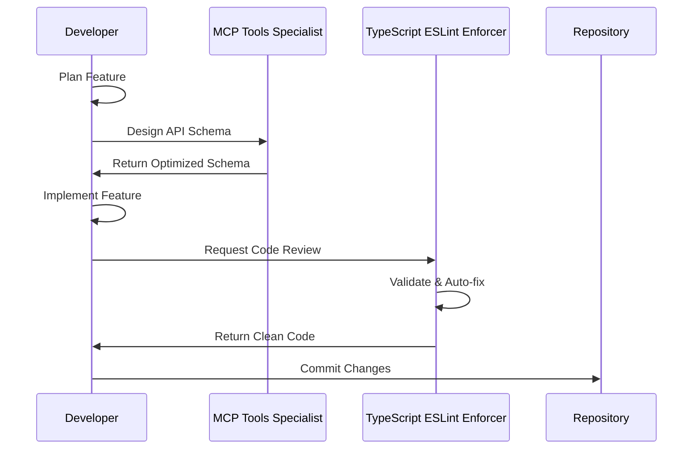
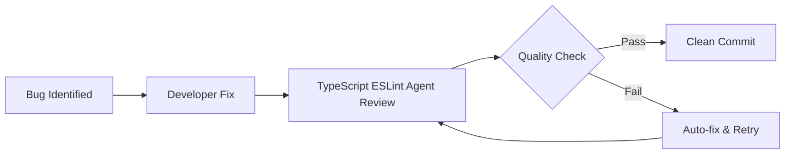
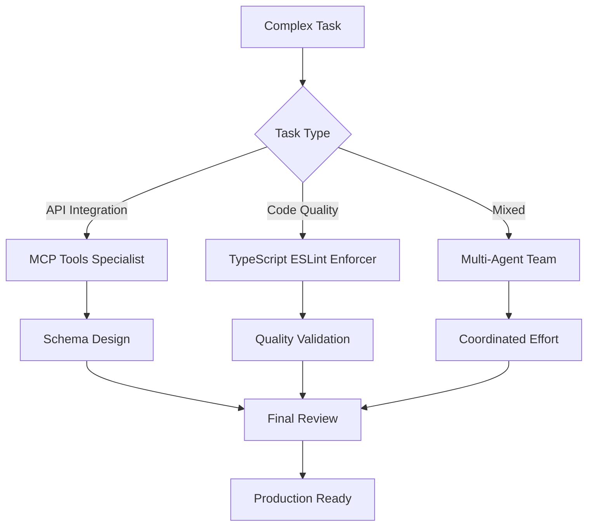

# Agent Team Collaboration Guide

## Overview

The Prophet Growth Analysis project leverages specialized AI agents to maintain enterprise-grade code quality and accelerate development. This guide documents our current agent team and provides patterns for future expansion.

## Current Agent Team 🤖

### **1. TypeScript ESLint Enforcer Agent** 🛡️

**Role**: Code Quality Guardian  
**Specialization**: Type safety and code standards enforcement

#### Capabilities

- Zero-tolerance TypeScript error enforcement
- Automatic ESLint violation fixes
- Import organization and cleanup
- React hooks compliance validation
- Pre-commit quality gates

#### When to Use

- ✅ After writing or modifying any TypeScript code
- ✅ Before committing changes to repository
- ✅ During code reviews and pull request validation
- ✅ When onboarding new team members
- ✅ Before deploying to production

#### Example Usage

```typescript
// After implementing a new feature
const newFeature = {
  implementation: 'Developer writes code',
  review: 'TypeScript ESLint Agent validates',
  result: 'Clean, type-safe code ready for commit',
};
```

### **2. MCP Tools Specialist Agent** 🔧

**Role**: Integration Architecture Expert  
**Specialization**: API design and integration patterns

#### Capabilities

- MCP tool schema design with Zod
- API integration pattern optimization
- Tool registration and validation
- Integration troubleshooting
- Schema validation enforcement

#### When to Use

- ✅ Designing new API integrations
- ✅ Creating custom tools or utilities
- ✅ Optimizing existing tool schemas
- ✅ Troubleshooting integration issues
- ✅ Validating external API patterns

#### Example Usage

```typescript
// When building new API endpoint
const apiDevelopment = {
  design: 'MCP Tools Specialist creates schema',
  implementation: 'Developer builds endpoint',
  validation: 'TypeScript ESLint Agent reviews',
  result: 'Production-ready API',
};
```

## Agent Collaboration Patterns 🔄

### **Pattern 1: Feature Development Workflow**



### **Pattern 2: Bug Fix Workflow**



### **Pattern 3: Multi-Agent Collaboration**



## Future Team Expansion 🚀

### **Planned Agent Additions**

#### **3. Frontend Specialist Agent** 🎨 (Phase 3)

**Role**: UI/UX Optimization Expert

```typescript
interface FrontendSpecialistCapabilities {
  responsibilities: [
    'React component optimization',
    'UI/UX consistency enforcement',
    'Accessibility compliance (WCAG)',
    'Performance optimization',
    'Mobile responsiveness validation',
  ];

  integrationPoints: [
    'Component development',
    'Style system enforcement',
    'Performance auditing',
    'Accessibility testing',
  ];

  collaboratesWith: [
    'TypeScript ESLint Enforcer', // Final validation
    'MCP Tools Specialist', // API integration UX
  ];
}
```

#### **4. Database Specialist Agent** 🗄️ (Phase 4)

**Role**: Data Architecture Expert

```typescript
interface DatabaseSpecialistCapabilities {
  responsibilities: [
    'Query optimization',
    'Migration management',
    'Schema validation',
    'Performance monitoring',
    'Data integrity enforcement',
  ];

  integrationPoints: [
    'Database schema changes',
    'Query performance issues',
    'Migration scripts',
    'Data validation',
  ];

  collaboratesWith: [
    'TypeScript ESLint Enforcer', // Code quality
    'MCP Tools Specialist', // API data patterns
  ];
}
```

#### **5. Security Specialist Agent** 🔒 (Phase 5)

**Role**: Security Compliance Guardian

```typescript
interface SecuritySpecialistCapabilities {
  responsibilities: [
    'Vulnerability scanning',
    'Authentication pattern validation',
    'API security enforcement',
    'Compliance verification',
    'Threat detection',
  ];

  integrationPoints: [
    'Authentication systems',
    'API security headers',
    'Data encryption',
    'Input validation',
  ];

  collaboratesWith: [
    'TypeScript ESLint Enforcer', // Secure coding
    'MCP Tools Specialist', // API security
    'Database Specialist', // Data protection
  ];
}
```

## Agent Hierarchy & Coordination 📊

### **Hierarchy Structure**

```typescript
interface AgentHierarchy {
  gatekeeper: {
    agent: 'TypeScript ESLint Enforcer';
    role: 'Final quality validation (mandatory for all commits)';
    authority: 'Can block commits until quality standards met';
  };

  specialists: {
    agents: [
      'MCP Tools Specialist',
      'Frontend Specialist',
      'Database Specialist',
      'Security Specialist',
    ];
    role: 'Domain-specific expertise and optimization';
    authority: 'Recommend changes, design patterns';
  };

  coordinators: {
    agents: ['General Purpose Agent'];
    role: 'Multi-domain task coordination';
    authority: 'Orchestrate complex workflows';
  };
}
```

### **Decision Making Protocol**

```typescript
interface DecisionProtocol {
  simpleDecisions: {
    authority: 'Individual specialist agents';
    scope: 'Domain-specific optimizations';
    validation: 'TypeScript ESLint Enforcer approval';
  };

  complexDecisions: {
    authority: 'Multi-agent collaboration';
    scope: 'Cross-domain architecture changes';
    process: [
      'Specialist agents provide domain input',
      'Coordinator synthesizes recommendations',
      'TypeScript ESLint Enforcer validates implementation',
    ];
  };

  conflictResolution: {
    arbitrator: 'TypeScript ESLint Enforcer';
    principle: 'Code quality and type safety take precedence';
    escalation: 'Return to developer with clear guidance';
  };
}
```

## Agent Integration Guidelines 📋

### **Adding New Agents**

1. **Define Agent Specification**

   ```typescript
   interface NewAgentSpec {
     role: string;
     specialization: string[];
     responsibilities: string[];
     integrationPoints: string[];
     collaboratesWith: string[];
     whenToUse: string[];
     whenNotToUse: string[];
   }
   ```

2. **Establish Collaboration Patterns**
   - Integration with existing workflow
   - Handoff protocols with other agents
   - Quality gate responsibilities
   - Escalation procedures

3. **Update Documentation**
   - Add to all three core documents (CLAUDE.md, ProjectContextEngineering.md, ProjectTasks.md)
   - Update this guide with new patterns
   - Create specific usage examples
   - Document collaboration workflows

4. **Test Integration**
   - Verify agent works with existing team
   - Validate quality gates function properly
   - Ensure no conflicts with current agents
   - Test escalation scenarios

### **Communication Protocols**

```typescript
interface CommunicationProtocol {
  taskAssignment: {
    clarity: 'Specific, actionable instructions';
    context: 'Full problem context provided';
    constraints: 'Clear boundaries and requirements';
    expectations: 'Defined success criteria';
  };

  statusReporting: {
    frequency: 'Real-time for blocking issues';
    format: 'Structured status updates';
    escalation: 'Immediate for quality failures';
    documentation: 'Comprehensive change logs';
  };

  handoffs: {
    completionCriteria: 'Clear deliverable definitions';
    qualityStandards: 'Validated against requirements';
    nextSteps: 'Clear instructions for receiving agent';
    rollback: 'Procedure for handling failures';
  };
}
```

## Quality Metrics & KPIs 📈

### **Agent Team Performance**

```typescript
interface TeamMetrics {
  codeQuality: {
    typescriptErrors: 0; // Enforced by TypeScript ESLint Agent
    eslintViolations: 0; // Auto-fixed
    testCoverage: number; // Target: >90%
    buildSuccess: number; // Target: 100%
  };

  development: {
    timeToReview: number; // Target: <5 minutes
    autoFixRate: number; // Target: >80%
    humanIntervention: number; // Target: <20%
    commitQuality: number; // Target: 100% clean
  };

  collaboration: {
    agentHandoffs: number; // Smooth transitions
    conflictResolution: number; // Target: <5%
    escalationRate: number; // Target: <10%
    teamSynergy: number; // Measured by task completion
  };
}
```

## Best Practices 🎯

### **For Developers**

1. **Proactive Agent Usage**
   - Use agents before issues arise
   - Don't wait for CI/CD to catch problems
   - Leverage agent expertise early in development

2. **Clear Communication**
   - Provide specific, actionable tasks
   - Include full context and requirements
   - Set clear success criteria

3. **Trust but Verify**
   - Trust agent recommendations
   - Verify changes align with project goals
   - Understand agent modifications

### **For Agent Integration**

1. **Maintain Hierarchy**
   - TypeScript ESLint Enforcer always has final say
   - Specialists provide domain expertise
   - Clear escalation paths

2. **Document Everything**
   - New agent capabilities
   - Changed workflows
   - Updated collaboration patterns

3. **Continuous Improvement**
   - Monitor agent performance
   - Gather feedback on effectiveness
   - Iterate on collaboration patterns

## Conclusion 🎉

Our AI-enhanced development team represents a new paradigm in software development - one where human creativity and AI precision work together to build exceptional products. As we expand our agent team, we maintain focus on:

- **Quality First**: Zero-tolerance for errors
- **Collaboration**: Seamless human-AI workflows
- **Scalability**: Patterns that grow with the team
- **Excellence**: Enterprise-grade standards

The future of Prophet Growth Analysis development is bright with our AI-enhanced team! 🚀
