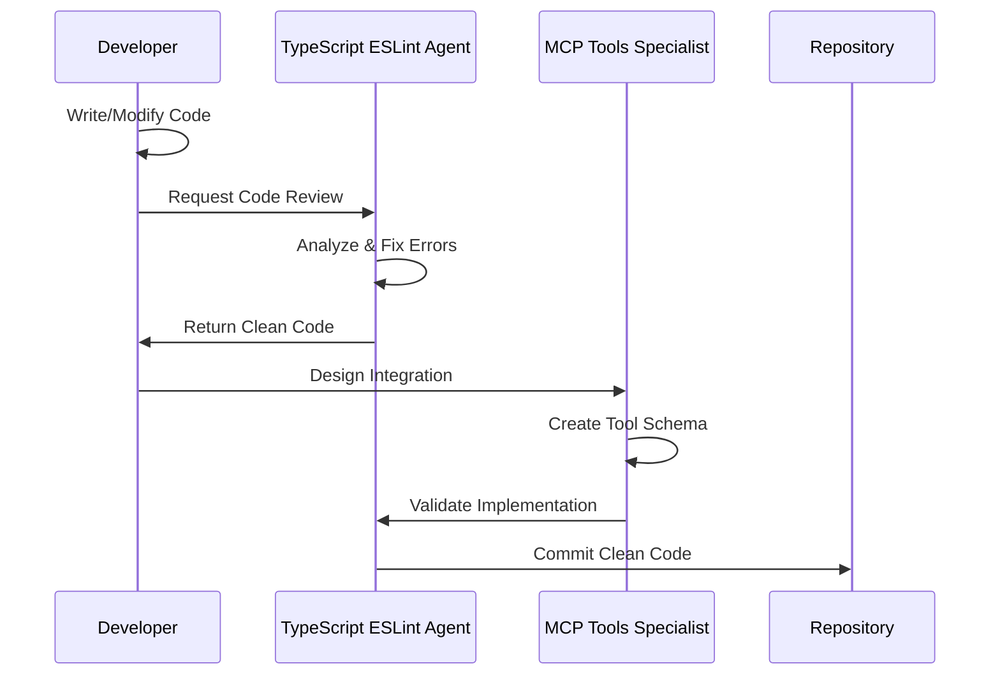

# Project Context Engineering

## Overview

**Prophet Growth Analysis** is an AI-powered financial intelligence platform that transforms workforce cost management through direct API integrations, predictive analytics, and intelligent automation. Built on a modern, scalable stack with Vercel + Neon + direct API approach for maximum simplicity and reliability.

## Business Vision

### Problem Statement

Organizations struggle with:

- Manual, reactive employee cost tracking
- Lack of predictive insights for workforce planning
- Siloed financial data across departments
- Time-consuming scenario planning
- Delayed decision-making on hiring/termination impacts

### Solution

A streamlined AI financial operations platform that:

- Provides instant cost analysis through Claude AI
- Predicts future costs with Prophet forecasting
- Enables voice-powered interactions via ElevenLabs
- Delivers executive-ready insights immediately
- Scales effortlessly with serverless infrastructure

## Technical Architecture

### Core Technologies

- **Frontend**: Next.js 15 with App Router, React 19, TypeScript
- **Deployment**: Vercel (zero-config, global CDN)
- **Database**: Neon PostgreSQL (serverless, auto-scaling)
- **AI Chat**: Anthropic Claude API (direct integration)
- **Voice**: ElevenLabs API (voice synthesis)
- **CLI Tools**: GitHub CLI, Neon CLI, Vercel CLI
- **Type Safety**: Zod validation, TypeScript strict mode

### Simplified Architecture Flow

```
┌─────────────────────────────────────────────────────────────┐
│                    Next.js App (Vercel)                     │
│                                                             │
│  ┌─────────────────────────────────────────────────────┐    │
│  │              React Components                        │    │
│  │  ┌──────────────┐  ┌──────────────┐  ┌─────────────┐ │    │
│  │  │ Analytics    │  │  AI Chat     │  │   Voice     │ │    │
│  │  │ Dashboard    │  │ Interface    │  │ Interface   │ │    │
│  │  └──────────────┘  └──────────────┘  └─────────────┘ │    │
│  └─────────────────┬───────────────────────────────────┘    │
└────────────────────┼────────────────────────────────────────┘
                     │ API Routes
┌────────────────────▼────────────────────────────────────────┐
│                  API Routes Layer                           │
│                                                             │
│  /api/chat ──────► Anthropic Claude API                     │
│  /api/voice ─────► ElevenLabs API                          │
│  /api/analyze ───► Financial Analysis Logic                │
│  /api/forecast ──► Prophet Forecasting                     │
│  /api/employees ─► Employee Management                      │
│  /api/auth ──────► Authentication Logic                    │
│                                                             │
└────────────────────┬────────────────────────────────────────┘
                     │ Database Queries
┌────────────────────▼────────────────────────────────────────┐
│                Neon PostgreSQL                              │
│                                                             │
│  ┌─────────────┐  ┌─────────────┐  ┌─────────────┐         │
│  │   Users &   │  │  Employee   │  │   Cost      │         │
│  │    Auth     │  │    Data     │  │  Analysis   │         │
│  └─────────────┘  └─────────────┘  └─────────────┘         │
│                                                             │
│  ┌─────────────┐  ┌─────────────┐  ┌─────────────┐         │
│  │ Conversation│  │ Forecasts & │  │ Audit Logs  │         │
│  │   History   │  │ Predictions │  │ & Sessions  │         │
│  └─────────────┘  └─────────────┘  └─────────────┘         │
└─────────────────────────────────────────────────────────────┘
```

### API Route Specifications

#### Core API Endpoints

**1. Chat API (`/api/chat`)**

- **Purpose**: Direct integration with Anthropic Claude
- **Input**: User message, conversation context
- **Output**: AI-generated financial insights
- **Features**: Context preservation, conversation memory

**2. Voice API (`/api/voice`)**

- **Purpose**: Text-to-speech via ElevenLabs
- **Input**: Text content, voice settings
- **Output**: Audio file/stream
- **Features**: Multiple voice options, SSML support

**3. Analysis API (`/api/analyze`)**

- **Purpose**: Financial cost analysis and recommendations
- **Input**: Employee data, time period, parameters
- **Output**: Detailed cost breakdown, insights, recommendations
- **Features**: Real-time calculations, comparative analysis

**4. Forecast API (`/api/forecast`)**

- **Purpose**: Time series prediction using Prophet
- **Input**: Historical data, forecast parameters
- **Output**: Predictions, confidence intervals, trends
- **Features**: Seasonal analysis, anomaly detection

### Data Models

#### Core Database Schema

```sql
-- Users and Authentication
CREATE TABLE users (
  id UUID PRIMARY KEY DEFAULT gen_random_uuid(),
  email VARCHAR(255) UNIQUE NOT NULL,
  password_hash VARCHAR(255) NOT NULL,
  name VARCHAR(255) NOT NULL,
  role VARCHAR(50) DEFAULT 'user',
  created_at TIMESTAMP DEFAULT CURRENT_TIMESTAMP,
  updated_at TIMESTAMP DEFAULT CURRENT_TIMESTAMP
);

-- Employees
CREATE TABLE employees (
  id UUID PRIMARY KEY DEFAULT gen_random_uuid(),
  user_id UUID REFERENCES users(id),
  name VARCHAR(255) NOT NULL,
  department VARCHAR(255),
  position VARCHAR(255),
  level VARCHAR(100),
  location VARCHAR(255),
  start_date DATE,
  base_salary DECIMAL(12,2),
  currency VARCHAR(3) DEFAULT 'USD',
  status VARCHAR(50) DEFAULT 'active',
  created_at TIMESTAMP DEFAULT CURRENT_TIMESTAMP
);

-- Cost Analysis
CREATE TABLE cost_analyses (
  id UUID PRIMARY KEY DEFAULT gen_random_uuid(),
  user_id UUID REFERENCES users(id),
  employee_id UUID REFERENCES employees(id),
  analysis_date DATE NOT NULL,
  base_salary DECIMAL(12,2),
  benefits_cost DECIMAL(12,2),
  overhead_cost DECIMAL(12,2),
  total_monthly_cost DECIMAL(12,2),
  total_annual_cost DECIMAL(12,2),
  utilization_rate DECIMAL(5,2),
  created_at TIMESTAMP DEFAULT CURRENT_TIMESTAMP
);

-- Conversation History
CREATE TABLE conversations (
  id UUID PRIMARY KEY DEFAULT gen_random_uuid(),
  user_id UUID REFERENCES users(id),
  message TEXT NOT NULL,
  response TEXT NOT NULL,
  context JSONB,
  created_at TIMESTAMP DEFAULT CURRENT_TIMESTAMP
);

-- Forecasts
CREATE TABLE forecasts (
  id UUID PRIMARY KEY DEFAULT gen_random_uuid(),
  user_id UUID REFERENCES users(id),
  forecast_type VARCHAR(100),
  time_period VARCHAR(50),
  predictions JSONB NOT NULL,
  confidence_score DECIMAL(5,2),
  created_at TIMESTAMP DEFAULT CURRENT_TIMESTAMP
);
```

#### TypeScript Types

```typescript
interface User {
  id: string;
  email: string;
  name: string;
  role: 'admin' | 'user';
  createdAt: Date;
}

interface Employee {
  id: string;
  userId: string;
  name: string;
  department: string;
  position: string;
  level: string;
  location: string;
  startDate: Date;
  baseSalary: number;
  currency: string;
  status: 'active' | 'inactive';
}

interface CostAnalysis {
  id: string;
  employeeId: string;
  employee: Employee;
  analysisDate: Date;
  baseSalary: number;
  benefitsCost: number;
  overheadCost: number;
  totalMonthlyCost: number;
  totalAnnualCost: number;
  utilizationRate: number;
}

interface Conversation {
  id: string;
  userId: string;
  message: string;
  response: string;
  context?: Record<string, unknown>;
  createdAt: Date;
}

interface Forecast {
  id: string;
  userId: string;
  forecastType: string;
  timePeriod: string;
  predictions: TimeSeries[];
  confidenceScore: number;
  createdAt: Date;
}
```

## Development Workflow

### Environment Setup

```bash
# Clone repository
git clone <repository-url>
cd prophet-growth-analysis

# Install dependencies
npm install

# Set up environment variables
cp .env.local.example .env.local
# Fill in your API keys and database URL

# Set up Neon database
neon branches create --name development
neon sql < migrations/001_initial.sql

# Start development server
npm run dev
```

### API Route Development Pattern

```typescript
// /app/api/example/route.ts
import { NextRequest, NextResponse } from 'next/server';
import { z } from 'zod';
import { authenticateUser } from '@/lib/auth';
import { db } from '@/lib/database';

const requestSchema = z.object({
  param: z.string(),
  options: z.object({}).optional(),
});

export async function POST(request: NextRequest) {
  try {
    // Authentication
    const user = await authenticateUser(request);
    if (!user) {
      return NextResponse.json({ error: 'Unauthorized' }, { status: 401 });
    }

    // Validation
    const body = await request.json();
    const { param, options } = requestSchema.parse(body);

    // Business logic
    const result = await processRequest(param, options, user.id);

    // Response
    return NextResponse.json({
      success: true,
      data: result,
    });
  } catch (error) {
    console.error('API Error:', error);
    return NextResponse.json({ error: 'Internal server error' }, { status: 500 });
  }
}
```

### CLI Tools Integration

#### GitHub CLI Workflow

```bash
# Create feature branch
git checkout -b feature/voice-interface

# Make changes...

# Create pull request
gh pr create --title "Add voice interface" --body "Implementation of ElevenLabs integration"

# Review and merge
gh pr view --web
gh pr merge --squash
```

#### Neon Database Management

```bash
# Create database branch for feature
neon branches create --name feature/voice-interface

# Run migrations
neon sql < migrations/002_add_voice_settings.sql

# Test queries
neon sql "SELECT * FROM users LIMIT 5"

# Merge to main branch
neon branches merge feature/voice-interface
```

#### Vercel Deployment

```bash
# Preview deployment
vercel

# Set environment variables
vercel env add ANTHROPIC_API_KEY production
vercel env add ELEVENLABS_API_KEY production

# Deploy to production
vercel --prod

# Check deployment status
vercel logs
```

## Security Architecture

### Authentication & Authorization

- **JWT-based authentication** with secure token storage
- **Role-based access control** (admin, user)
- **API key management** via environment variables
- **Rate limiting** on all public endpoints
- **Input validation** using Zod schemas

### Data Protection

- **Encrypted connections** (HTTPS, TLS)
- **Secure password hashing** with bcrypt
- **SQL injection prevention** with prepared statements
- **XSS protection** via Next.js built-in security
- **CSRF protection** with proper headers

## Performance Optimization

### Database Optimization

- **Connection pooling** (handled by Neon)
- **Query optimization** with proper indexing
- **Database branching** for development/testing
- **Automatic scaling** based on usage

### API Optimization

- **Response caching** for expensive operations
- **Request batching** for multiple operations
- **Error handling** with proper status codes
- **Rate limiting** to prevent abuse

### Frontend Optimization

- **Server-side rendering** with Next.js
- **Static generation** where possible
- **Code splitting** for optimal bundle size
- **Image optimization** via Next.js Image component

## Deployment Pipeline

### Development Environment

```bash
# Local development
npm run dev          # Next.js dev server
vercel dev           # Local with Vercel functions
neon sql             # Database access
```

### Staging Environment

```bash
# Preview deployment
vercel                # Automatic preview
neon branches create  # Database branch
npm run test         # Run all tests
```

### Production Environment

```bash
# Production deployment
vercel --prod        # Deploy to production
vercel alias         # Set custom domain
vercel logs          # Monitor deployment
```

## Monitoring & Analytics

### Performance Monitoring

- **Vercel Analytics** for web vitals and performance
- **Database metrics** via Neon dashboard
- **API response times** and error rates
- **User engagement** and feature usage

### Error Tracking

- **Vercel Error Reporting** for runtime errors
- **Console logging** for debugging
- **Database query monitoring** for performance issues
- **API usage tracking** for cost management

## Future Roadmap

### Phase 1: Core Platform (Current)

- ✅ Next.js 15 app structure
- ✅ Vercel deployment
- ✅ Neon database setup
- 🔄 API routes implementation
- 🔄 Authentication system

### Phase 2: AI Integration

- 📋 Anthropic Claude chat interface
- 📋 ElevenLabs voice synthesis
- 📋 Prophet forecasting integration
- 📋 Real-time analysis features

### Phase 3: Advanced Features

- 📋 Advanced analytics dashboard
- 📋 Export capabilities (PDF, Excel)
- 📋 Collaborative features
- 📋 Mobile-responsive design

### Phase 4: Enterprise Features

- 📋 Multi-tenant architecture
- 📋 Advanced security features
- 📋 Integration APIs
- 📋 White-label solutions

## Success Metrics

### Technical KPIs

- **99.9% uptime** via Vercel's global infrastructure
- **<200ms API response time** for most endpoints
- **Zero TypeScript/ESLint errors** in codebase
- **100% test coverage** for critical paths

### Business KPIs

- **30% reduction** in manual analysis time
- **15% improvement** in cost prediction accuracy
- **50% faster** scenario planning and decision-making
- **25% cost savings** identified through AI insights

### User KPIs

- **Intuitive user experience** with clear navigation
- **Real-time responsiveness** for all interactions
- **Accessible design** meeting WCAG guidelines
- **Seamless voice integration** for enhanced UX

## Development Team Architecture

### **AI-Enhanced Development Team**

Our development process leverages specialized AI agents to maintain enterprise-grade standards and accelerate feature development:

#### **Core Agent Team**

**1. TypeScript ESLint Enforcer Agent** 🛡️

```typescript
interface AgentCapabilities {
  role: 'Code Quality Guardian';
  responsibilities: [
    'Zero-tolerance TypeScript error enforcement',
    'Automatic code quality fixes',
    'Enterprise standards compliance',
    'Pre-commit validation',
  ];
  expertise: [
    'TypeScript strict mode',
    'ESLint rule enforcement',
    'React hooks compliance',
    'Import organization',
    'Type safety validation',
  ];
}
```

**2. MCP Tools Specialist Agent** 🔧

```typescript
interface AgentCapabilities {
  role: 'Integration Architecture Expert';
  responsibilities: [
    'API integration patterns',
    'Tool schema optimization',
    'Zod validation design',
    'Integration troubleshooting',
  ];
  expertise: [
    'MCP protocol design',
    'API architecture patterns',
    'Schema validation',
    'Tool registration',
  ];
}
```

### **Agent Integration Workflow**



### **Quality Assurance Pipeline**

1. **Development Phase**
   - Write feature code
   - Automatic agent code review
   - Type safety enforcement
   - Style consistency validation

2. **Integration Phase**
   - API schema validation
   - Tool registration verification
   - Integration pattern compliance
   - Error handling validation

3. **Commit Phase**
   - Final TypeScript compilation check
   - ESLint rule compliance
   - Import organization
   - Clean commit preparation

### **Agent Collaboration Patterns**

#### **Pattern 1: Feature Development**

```typescript
// Development workflow
const featureDevelopment = {
  step1: 'Developer writes initial code',
  step2: 'TypeScript ESLint Agent reviews and fixes',
  step3: 'MCP Tools Specialist optimizes integrations',
  step4: 'TypeScript ESLint Agent final validation',
  step5: 'Clean commit ready',
};
```

#### **Pattern 2: Bug Fixes**

```typescript
// Bug fix workflow
const bugFixWorkflow = {
  step1: 'Identify and fix issue',
  step2: 'TypeScript ESLint Agent ensures quality',
  step3: 'Regression testing validation',
  step4: 'Clean deployment',
};
```

#### **Pattern 3: New Team Member Onboarding**

```typescript
// Onboarding workflow
const onboardingProcess = {
  step1: 'New agent defines capabilities',
  step2: 'Integration with existing workflow',
  step3: 'Documentation updates',
  step4: 'Collaboration pattern establishment',
};
```

### **Future Team Expansion**

As we add specialized agents:

**Frontend Specialist Agent** (Future)

- React component optimization
- UI/UX consistency enforcement
- Accessibility compliance
- Performance optimization

**Database Specialist Agent** (Future)

- Query optimization
- Migration management
- Schema validation
- Performance monitoring

**Security Specialist Agent** (Future)

- Security vulnerability scanning
- Authentication pattern validation
- API security enforcement
- Compliance verification

### **Agent Coordination Protocol**

```typescript
interface AgentCoordination {
  hierarchy: {
    gatekeeper: 'TypeScript ESLint Enforcer'; // Always final step
    specialists: 'Domain-specific experts';
    support: 'General task assistance';
  };

  handoffProtocol: {
    specialist_to_gatekeeper: 'Quality validation required';
    gatekeeper_approval: 'Code ready for commit';
    error_feedback: 'Return to specialist for fixes';
  };

  communication: {
    clear_instructions: 'Specific, actionable tasks';
    context_sharing: 'Full problem context provided';
    result_documentation: 'Comprehensive change reports';
  };
}
```

### **Development Quality Metrics**

Our AI-enhanced team maintains:

- **Zero TypeScript errors** (enforced automatically)
- **Zero ESLint violations** (fixed proactively)
- **100% type safety** (validated at compile time)
- **Consistent code style** (auto-formatted)
- **Clean commit history** (quality-gated)

Remember: We're building a **simple, scalable, and intelligent financial platform** with **AI-enhanced development workflows** that leverage modern tools and direct API integrations for maximum reliability and performance.
