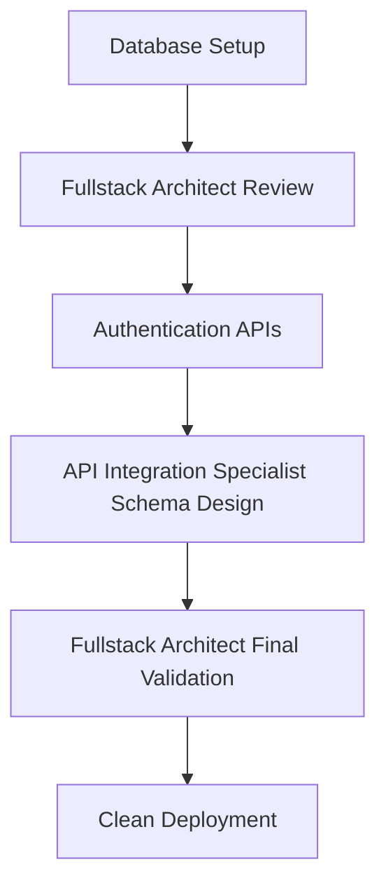
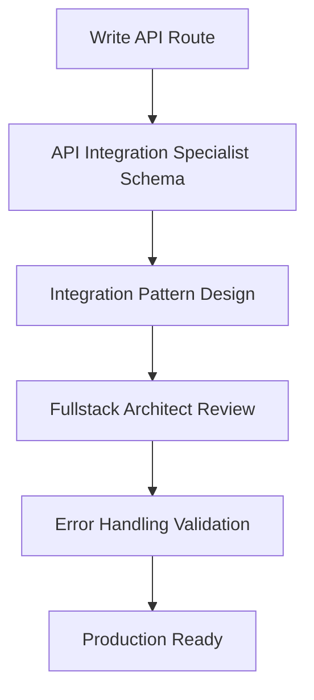

# Project Tasks - Prophet Growth Analysis

## AI Financial Intelligence Platform Implementation

### ✅ Completed (February 2025)

#### Infrastructure Migration

- [x] Removed complex architecture dependencies
- [x] Cleaned up package.json dependencies
- [x] Updated core documentation for Vercel + Neon stack
- [x] Deleted 40+ obsolete files and directories
- [x] Simplified to Next.js 15 + direct API approach

#### Foundation Setup (Previous)

- [x] Next.js 15 project with TypeScript
- [x] JWT authentication system
- [x] Environment configuration with Zod
- [x] Basic AI chat interface
- [x] Employee cost data models
- [x] Analytics dashboard UI components

### 🚀 Phase 1: Core Infrastructure Setup (Week 1)

#### Database & Authentication

- [ ] Set up Neon PostgreSQL database
  - [ ] Create production database
  - [ ] Set up development branch
  - [ ] Run initial migration scripts
  - [ ] Configure connection pooling
- [ ] Implement authentication system
  - [ ] JWT token management
  - [ ] User registration/login API routes
  - [ ] Password hashing with bcrypt
  - [ ] Session management
- [ ] Create core database schema:
  - [ ] Users table with roles
  - [ ] Employees table with cost data
  - [ ] Conversations table for chat history
  - [ ] Forecasts table for predictions
  - [ ] Cost analyses table

#### Vercel Deployment Setup

- [ ] Configure Vercel project
  - [ ] Connect GitHub repository
  - [ ] Set up environment variables
  - [ ] Configure build settings
  - [ ] Set up custom domain
- [ ] Set up deployment pipeline
  - [ ] Automatic deployments from main branch
  - [ ] Preview deployments for PRs
  - [ ] Environment-specific configurations

### 🔮 Phase 2: API Routes Implementation (Week 2)

#### Core API Endpoints

- [ ] Authentication APIs
  - [ ] `POST /api/auth/login` - User login
  - [ ] `POST /api/auth/register` - User registration
  - [ ] `POST /api/auth/logout` - User logout
  - [ ] `GET /api/auth/me` - Get current user
- [ ] Chat API with Google Gemini
  - [ ] `POST /api/chat` - Send message to Gemini
  - [ ] Context preservation for conversations
  - [ ] Response streaming for real-time chat
  - [ ] Conversation history storage
- [ ] Employee Management APIs
  - [ ] `GET /api/employees` - List employees
  - [ ] `POST /api/employees` - Create employee
  - [ ] `PUT /api/employees/:id` - Update employee
  - [ ] `DELETE /api/employees/:id` - Delete employee
- [ ] Financial Analysis APIs
  - [ ] `POST /api/analyze` - Analyze employee costs
  - [ ] `GET /api/analyze/:id` - Get analysis results
  - [ ] Cost calculation logic
  - [ ] Benefits and overhead calculations

#### Voice Integration

- [ ] ElevenLabs voice synthesis
  - [ ] `POST /api/voice` - Convert text to speech
  - [ ] Multiple voice options
  - [ ] Audio streaming support
  - [ ] Voice settings management
- [ ] Audio playback components
  - [ ] Voice controls in chat interface
  - [ ] Audio player component
  - [ ] Voice preference settings

### 🧠 Phase 3: AI & Forecasting Features (Week 3)

#### Prophet Integration

- [ ] Time series forecasting
  - [ ] `POST /api/forecast` - Generate forecasts
  - [ ] Prophet model implementation
  - [ ] Seasonal pattern detection
  - [ ] Confidence interval calculations
- [ ] Historical data processing
  - [ ] Data preparation for forecasting
  - [ ] Trend analysis
  - [ ] Anomaly detection
- [ ] Forecast visualization
  - [ ] Interactive forecast charts
  - [ ] Confidence bands display
  - [ ] Historical vs predicted comparison

#### Advanced Analytics

- [ ] Dashboard enhancements
  - [ ] Real-time cost metrics
  - [ ] Department-wise breakdowns
  - [ ] Trend visualization
  - [ ] Executive summary cards
- [ ] Export capabilities
  - [ ] PDF report generation
  - [ ] Excel data export
  - [ ] CSV download options
  - [ ] Scheduled reports

### 📊 Phase 4: Enhanced User Experience (Week 4)

#### Frontend Improvements

- [ ] Responsive design optimization
  - [ ] Mobile-first approach
  - [ ] Tablet optimization
  - [ ] Touch-friendly interactions
- [ ] Loading states and error handling
  - [ ] Skeleton loaders
  - [ ] Error boundaries
  - [ ] Retry mechanisms
  - [ ] Offline support
- [ ] Accessibility improvements
  - [ ] WCAG compliance
  - [ ] Keyboard navigation
  - [ ] Screen reader support
  - [ ] High contrast mode

#### Real-time Features

- [ ] Server-sent events for live updates
  - [ ] Real-time cost updates
  - [ ] Live forecast updates
  - [ ] Notification system
- [ ] Progressive web app features
  - [ ] Service worker implementation
  - [ ] Offline functionality
  - [ ] Push notifications
  - [ ] App-like experience

### 🏢 Phase 5: Enterprise Features (Week 5-6)

#### Advanced Security

- [ ] Enhanced authentication
  - [ ] Multi-factor authentication
  - [ ] OAuth provider integration
  - [ ] Session timeout management
  - [ ] Security audit logging
- [ ] Role-based access control
  - [ ] Admin role capabilities
  - [ ] User permission management
  - [ ] Resource-level permissions
  - [ ] Audit trail system

#### Integration & API

- [ ] External integrations
  - [ ] HRIS system connectors
  - [ ] Payroll system integration
  - [ ] Slack/Teams notifications
  - [ ] Email notifications
- [ ] Public API development
  - [ ] RESTful API endpoints
  - [ ] API authentication
  - [ ] Rate limiting
  - [ ] API documentation

#### Performance & Monitoring

- [ ] Performance optimization
  - [ ] Database query optimization
  - [ ] Caching implementation
  - [ ] Image optimization
  - [ ] Bundle size optimization
- [ ] Monitoring setup
  - [ ] Error tracking
  - [ ] Performance monitoring
  - [ ] Usage analytics
  - [ ] Cost monitoring

### 🚀 Phase 6: Advanced Features (Week 7-8)

#### CLI Tools Integration

- [ ] GitHub CLI workflow
  - [ ] Automated PR creation
  - [ ] Issue management
  - [ ] Repository operations
  - [ ] Code review automation
- [ ] Neon CLI database management
  - [ ] Database branching
  - [ ] Migration management
  - [ ] Query execution
  - [ ] Backup operations
- [ ] Vercel CLI deployment
  - [ ] Environment management
  - [ ] Deployment automation
  - [ ] Log monitoring
  - [ ] Domain management

#### Collaboration Features

- [ ] Multi-user scenarios
  - [ ] Shared workspaces
  - [ ] Real-time collaboration
  - [ ] Comment system
  - [ ] Version control
- [ ] Approval workflows
  - [ ] Decision approval chains
  - [ ] Review processes
  - [ ] Notification system
  - [ ] Audit trails

### 📈 Phase 7: Scale & Polish (Week 9-10)

#### Scalability Improvements

- [ ] Database optimization
  - [ ] Connection pooling
  - [ ] Query optimization
  - [ ] Indexing strategy
  - [ ] Archival system
- [ ] Caching strategy
  - [ ] Redis implementation
  - [ ] API response caching
  - [ ] Static asset caching
  - [ ] Database query caching

#### Final Polish

- [ ] UI/UX refinements
  - [ ] Design system consistency
  - [ ] Animation improvements
  - [ ] Micro-interactions
  - [ ] User onboarding
- [ ] Documentation completion
  - [ ] API documentation
  - [ ] User guides
  - [ ] Developer documentation
  - [ ] Deployment guides

## CLI Tools Workflow Integration

### GitHub CLI Tasks

- [ ] Set up automated PR workflows
- [ ] Create issue templates
- [ ] Set up branch protection rules
- [ ] Configure repository settings
- [ ] Set up GitHub Actions for CI/CD

### Neon Database Tasks

- [ ] Create database branches for features
- [ ] Set up automated backups
- [ ] Configure connection pooling
- [ ] Set up monitoring alerts
- [ ] Create migration scripts

### Vercel Deployment Tasks

- [ ] Configure environment variables
- [ ] Set up domain and SSL
- [ ] Configure edge functions
- [ ] Set up analytics
- [ ] Configure monitoring

## Success Metrics

### Technical Metrics

- Zero TypeScript/ESLint errors
- <200ms API response time
- 99.9% uptime
- 100% test coverage for critical paths
- Lighthouse score >90

### Business Metrics

- Complete migration to Vercel/Neon stack
- Direct API integrations working smoothly
- Voice interface fully functional
- Advanced forecasting capabilities
- Real-time collaboration features

### User Metrics

- Intuitive chat interface with Google Gemini
- Seamless voice interactions
- Fast, responsive dashboard
- Mobile-optimized experience
- Accessible design compliance

## Architecture Decisions

### Why Vercel + Neon?

- **Simplicity**: No complex agent orchestration
- **Scalability**: Serverless auto-scaling
- **Performance**: Edge deployment and caching
- **Developer Experience**: Zero-config deployment
- **Cost Efficiency**: Pay-per-use pricing

### Why Direct API Integration?

- **Reliability**: Fewer moving parts
- **Maintainability**: Simpler codebase
- **Performance**: Direct connections
- **Debugging**: Easier to troubleshoot
- **Security**: Fewer attack vectors

### Why This Approach?

- **Modern Stack**: Latest Next.js and React features
- **Type Safety**: End-to-end TypeScript
- **Best Practices**: Industry-standard patterns
- **Future-Proof**: Easily extensible architecture
- **Developer Friendly**: Great development experience

## Implementation Priority

### High Priority (Must Have)

1. Database setup and authentication
2. Core API routes (chat, analyze)
3. Basic UI functionality
4. Vercel deployment

### Medium Priority (Should Have)

1. Voice integration
2. Forecasting features
3. Advanced analytics
4. Mobile optimization

### Low Priority (Could Have)

1. Advanced integrations
2. Enterprise features
3. CLI automation
4. Advanced monitoring

## Agent-Enhanced Development Workflow

### **Development Team Integration**

Our implementation leverages specialized AI agents to maintain enterprise-grade quality and accelerate development:

#### **Core Development Agents**

**🏗️ Fullstack Architect Agent**

- **Integration Points**: Complex feature development, architecture decisions, full-stack reviews
- **Automated Tasks**:
  - Architecture guidance and recommendations
  - Full-stack code reviews
  - Performance optimization analysis
  - Database design validation
  - Security best practices enforcement
- **Workflow**: Comprehensive development expertise for complex implementations

**🔌 API Integration Specialist Agent**

- **Integration Points**: API design and integration tasks
- **Automated Tasks**:
  - Schema validation with Zod
  - Tool architecture design
  - Integration pattern optimization
  - API troubleshooting
- **Workflow**: Design-first integration approach

### **Agent-Integrated Task Execution**

Each development phase now includes agent collaboration:

#### **Phase 1: Core Infrastructure Setup**



#### **Phase 2: API Routes Implementation**



### **Quality Assurance Integration**

Every task now includes automated quality gates:

1. **Code Writing Phase**
   - Developer implements feature
   - Fullstack Architect reviews architecture and patterns
   - Code quality and best practices validation
   - Performance and security analysis

2. **Integration Phase**
   - API Integration Specialist validates schemas
   - API pattern compliance check
   - Error handling verification
   - Integration optimization review

3. **Commit Phase**
   - Final Fullstack Architect validation
   - Enterprise standards enforcement
   - Clean, maintainable code verification
   - Documentation and testing completeness

### **Agent Task Assignments**

#### **Phase 1 Tasks with Agent Integration**

- [ ] **Set up Neon PostgreSQL database**
  - **Implementation**: Developer
  - **Agent Review**: Fullstack Architect validates database architecture and connection patterns
  - **Schema Design**: API Integration Specialist optimizes database queries and schemas

- [ ] **Implement authentication system**
  - **Implementation**: Developer
  - **Security Review**: Fullstack Architect validates JWT patterns, security best practices
  - **Schema Validation**: API Integration Specialist ensures proper request/response schemas

#### **Phase 2 Tasks with Agent Integration**

- [ ] **Chat API with Google Gemini**
  - **Schema Design**: API Integration Specialist creates request/response types and validation
  - **Implementation**: Developer builds endpoint
  - **Architecture Review**: Fullstack Architect validates API patterns and error handling
  - **Quality Gate**: Fullstack Architect ensures enterprise standards before commit

- [ ] **Voice integration with ElevenLabs**
  - **API Pattern**: API Integration Specialist designs audio streaming and file handling
  - **Implementation**: Developer builds voice endpoints
  - **Performance Review**: Fullstack Architect optimizes audio processing and delivery
  - **Final Review**: Fullstack Architect ensures scalable, clean implementation

### **Future Agent Expansion Tasks**

As we add more team members:

#### **Phase 5: Advanced Agent Integration**

- [ ] **Frontend Specialist Agent** (Future)
  - React component optimization
  - UI/UX consistency enforcement
  - Accessibility compliance
  - Performance monitoring

- [ ] **Database Specialist Agent** (Future)
  - Query optimization
  - Migration management
  - Performance monitoring
  - Data validation

- [ ] **Security Specialist Agent** (Future)
  - Vulnerability scanning
  - Authentication validation
  - API security enforcement
  - Compliance verification

### **Agent Coordination Protocol**

```typescript
interface TaskExecution {
  workflow: {
    step1: 'Developer implements feature';
    step2: 'API Integration Specialist handles schemas (if applicable)';
    step3: 'Fullstack Architect validates architecture and quality';
    step4: 'Clean, enterprise-ready commit';
  };

  qualityGates: {
    codeReview: 'Fullstack Architect (mandatory for all complex tasks)';
    integration: 'API Integration Specialist (API and schema design)';
    architecture: 'Fullstack Architect (scalability and patterns)';
    security: 'Fullstack Architect (current), Future Security Specialist';
    performance: 'Fullstack Architect (current), Future Performance Specialist';
  };

  escalation: {
    blockingIssues: 'Return to developer with detailed feedback';
    qualityFailure: 'Agent provides fixes and recommendations';
    complexIssues: 'Multi-agent collaboration with clear handoffs';
    architectureDecisions: 'Always involve Fullstack Architect';
  };
}
```

### **Development Quality Metrics with Agents**

Our AI-enhanced development maintains:

- **Zero TypeScript errors** (Fullstack Architect enforcement)
- **Zero ESLint violations** (Automated fixing)
- **100% type safety** (Compile-time validation)
- **Consistent API patterns** (API Integration Specialist)
- **Enterprise architecture** (Fullstack Architect guidance)
- **Clean commit history** (Quality-gated)
- **Scalable solutions** (Architecture-first approach)

### **Agent Usage Guidelines**

1. **Proactive Integration**: Use agents before issues arise
2. **Clear Task Definition**: Provide specific, actionable instructions
3. **Architecture First**: Always involve Fullstack Architect for complex features
4. **Schema Validation**: Use API Integration Specialist for API design
5. **Quality Gates**: Ensure all changes pass agent review before commits
6. **Documentation**: Keep agent capabilities updated as team grows
7. **Collaboration**: Leverage multi-agent workflows for complex tasks

## Enhanced Agent Hook System

### **Overview**

Our sophisticated hook system provides specialized context loading, post-task actions, and validation for each agent type, ensuring maximum efficiency and knowledge preservation.

### **Hook System Features**

#### **1. Agent-Specific Context Loading**

Each agent receives tailored context:

- **Neon Database Architect**: Database schemas, connection patterns, optimization history
- **Vercel Deployment Specialist**: Deployment configs, environment variables, build logs
- **Security Auditor Expert**: Security patterns, vulnerability history, compliance checks
- **API Integration Specialist**: API docs, rate limits, integration patterns

#### **2. Agent-Specific Post-Task Actions**

Specialized knowledge preservation:

- **Project Docs Curator**: Auto-update documentation, generate changelogs
- **Neon Database Architect**: Save query patterns, schema improvements
- **Security Auditor Expert**: Generate security audit reports
- **Performance Optimizer**: Record performance metrics

#### **3. Agent-Specific Validation**

Domain-specific health checks:

- **Vercel Deployment Specialist**: Verify deployment health
- **Neon Database Architect**: Test database connections
- **Security Auditor Expert**: Scan for exposed secrets

### **Hook Configuration Structure**

```
.claude/
├── hooks-config.json         # Main configuration (v2.0.0)
├── settings.local.json       # Hook integration
├── scripts/
│   ├── pre-task-context.sh   # Universal context
│   ├── post-task-update.sh   # Universal updates
│   ├── agents/               # Agent-specific
│   │   ├── neon-db-context.sh
│   │   ├── vercel-deploy-context.sh
│   │   ├── security-audit-context.sh
│   │   ├── api-integration-context.sh
│   │   ├── docs-curator-update.sh
│   │   └── performance-metrics.sh
│   └── validation/           # Health checks
│       ├── vercel-health-check.sh
│       ├── neon-db-validate.sh
│       └── security-scan.sh
```

### **Implementation Status**

✅ **Completed**:

- Hook configuration v2.0.0 with agent-specific matchers
- All agent context loading scripts
- Post-task action scripts
- Validation scripts
- Core documentation updates

### **Using the Hook System**

1. **Automatic Activation**: Hooks trigger automatically based on agent type
2. **Context Awareness**: Every agent starts fully informed
3. **Knowledge Preservation**: Learnings are captured automatically
4. **Validation**: Health checks ensure system integrity

### **Benefits**

- **Specialized Context**: Each agent gets exactly what they need
- **Automated Workflows**: No manual context loading required
- **Knowledge Growth**: System becomes smarter over time
- **Quality Assurance**: Built-in validation at every step

Remember: **We're building a clean, scalable financial intelligence platform with modern tools, direct API integrations, and AI-enhanced development workflows for maximum reliability and performance.**
